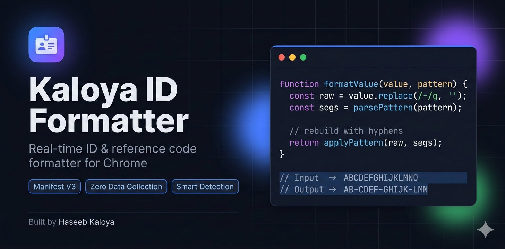

<div align="center">


<br/><br/>


<br/><br/>
<h1>Kaloya ID Formatter</h1>

<p><strong>A professional Chrome extension that silently formats identification numbers,<br/>reference codes, and verification tokens in real time — exactly as you type.</strong></p>

<br/>

> Built and maintained by **Haseeb Kaloya**  
> [`haseebkaloya@gmail.com`](mailto:haseebkaloya@gmail.com) &nbsp;·&nbsp; [`0345-1622556`](tel:03451622556)

<br/>
---

</div>

## The Problem It Solves

Every day, professionals working with government portals, financial systems, and verification platforms face the same friction: the ID or reference code they receive is a flat, unbroken string — `ABCDEFGHIJKLMNO` — but the input field demands it formatted with hyphens — `AB-CDEF-GHIJK-LMN`. The user must either type carefully, paste and manually correct, or memorize the exact segment pattern.

For accountants, tax consultants, data-entry operators, and administrative staff handling dozens of such entries daily, this is not a minor inconvenience — it is a compounding time cost and a constant source of typographical errors.

**Kaloya ID Formatter eliminates this entirely.** The extension watches as you type, strips any existing separators, and instantly rebuilds the value in the correct formatted pattern — without you pressing any button, without reloading the page, and without any interruption to your natural typing flow.

---

## Table of Contents

- [Features](#features)
- [Supported Patterns](#supported-patterns)
- [Installation](#installation)
- [How It Works](#how-it-works)
- [File Structure](#file-structure)
- [Configuration](#configuration)
- [Website Whitelist](#website-whitelist)
- [Smart Field Detection](#smart-field-detection)
- [Writing Custom Patterns](#writing-custom-patterns)
- [Privacy & Security](#privacy--security)
- [Browser Compatibility](#browser-compatibility)
- [Author](#author)
- [License](#license)

---

## Features

<table>
<tr>
<td width="50%" valign="top">

**Real-Time Formatting**  
Formatting triggers on every keystroke. As you type or paste a value, the extension immediately strips existing separators and rebuilds the string in the correct pattern — with precise cursor-position preservation so editing mid-string feels completely natural.

</td>
<td width="50%" valign="top">

**Smart Field Detection**  
The extension does not blindly reformat every text input it finds. It inspects each field's `name`, `id`, `placeholder`, `aria-label`, and associated `<label>` text for keywords that indicate the field expects an ID or reference code.

</td>
</tr>
<tr>
<td width="50%" valign="top">

**Configurable Patterns**  
Choose from four built-in patterns — FBR/CPR reference, phone number, credit card, and CNIC — or define your own using a simple numeric segment notation. All patterns are saved locally and persist across browser restarts.

</td>
<td width="50%" valign="top">

**Website Whitelist**  
Restrict the formatter to specific domains you trust. The whitelist supports subdomain inheritance: adding `fbr.gov.pk` automatically covers `iris.fbr.gov.pk`, `taxpayer.fbr.gov.pk`, and any other subdomain.

</td>
</tr>
<tr>
<td width="50%" valign="top">

**Live Preview Popup**  
The toolbar popup includes an interactive preview box. Type or paste any string and see the formatted output immediately — without touching any real page. Toggle the formatter on or off directly from the popup.

</td>
<td width="50%" valign="top">

**Zero Data Transmission**  
Every operation — formatting, pattern matching, settings storage — happens entirely within your browser. No data is sent to any server. No analytics, no telemetry, no network requests of any kind.

</td>
</tr>
<tr>
<td width="50%" valign="top">

**Dynamic DOM Support**  
The extension uses a `MutationObserver` to watch for inputs added to the page after initial load. Single-page applications, dynamic portals, and AJAX-driven forms are all handled automatically.

</td>
<td width="50%" valign="top">

**Instant Settings Sync**  
Changes made in the Settings page propagate to already-open tabs immediately via `chrome.storage.onChanged` — no page reload required.

</td>
</tr>
</table>

---

## Supported Patterns

| Pattern | Use Case | Raw Input | Formatted Output |
|---|---|---|---|
| `2-4-5-rest` | FBR / CPR Reference Numbers | `ABCDEFGHIJKLMNO` | `AB-CDEF-GHIJK-LMN` |
| `3-3-4` | Phone Numbers | `0512345678` | `051-234-5678` |
| `4-4-4-4` | Credit Card Numbers | `1234567890123456` | `1234-5678-9012-3456` |
| `5-7-1` | Pakistani CNIC | `3520212345678` | `35202-1234567-8` |

Custom patterns can be defined and saved directly in the Settings page. See [Writing Custom Patterns](#writing-custom-patterns) for the full syntax reference.

---

## Installation

### Method 1 — Load Unpacked (Developer Mode)

This is the recommended method for personal use and development.

**Step 1.** Download or clone this repository to your local machine.

```bash
git clone https://github.com/haseebkaloya/kaloya-id-formatter.git
```

**Step 2.** Open Google Chrome and navigate to the extensions management page.

```
chrome://extensions/
```

**Step 3.** Enable **Developer mode** using the toggle in the top-right corner of the page.

**Step 4.** Click **Load unpacked** and select the `smart-id-formatter` folder from the cloned repository.

**Step 5.** The extension icon will appear in your Chrome toolbar. Click it to open the popup and begin using the formatter immediately.

> **Note:** The extension will remain installed across Chrome restarts. If you update the source files, click the **refresh icon** on the extension card in `chrome://extensions/` to reload it.

### Method 2 — Chrome Web Store

Publication to the Chrome Web Store is planned for a future release. This section will be updated with a direct installation link once the extension is live.

---

## How It Works

The extension consists of five components that work together in a clean, modular pipeline.

```
User types into a field
        │
        ▼
  content.js — listens for `input` events
        │
        ├── isAllowedOnCurrentSite()  →  checks whitelist
        ├── isIDField()               →  checks field keywords
        │
        ▼
  formatter.js — core formatting engine
        │
        ├── strips existing hyphens from raw value
        ├── applies segment pattern (e.g. 2-4-5-rest)
        ├── maps cursor position: formatted → raw → formatted
        │
        ▼
  input.value updated + cursor restored
```

**Cursor Preservation** is the most technically nuanced part of the formatter. Because the value is rewritten on every keystroke, the cursor would normally jump to the end. The formatter solves this by translating the cursor position from the formatted string into the raw (hyphen-free) string before applying the pattern, then translating it back into the new formatted string after. This allows natural mid-string editing — backspacing, selecting, and inserting characters all behave exactly as expected.

---

## File Structure

```
smart-id-formatter/
│
├── manifest.json               Chrome extension manifest (Manifest V3)
│
├── popup.html                  Toolbar popup interface
├── popup.js                    Popup logic — toggle, live preview
│
├── options.html                Full settings page
├── options.js                  Settings logic — patterns, whitelist, behaviour
│
├── guide.html                  Pattern reference guide (opens in new tab)
│
├── src/
│   ├── formatter.js            Core formatting engine (pattern parser, cursor mapper)
│   ├── content.js              Content script — field detection, input listener, DOM observer
│   └── background.js           Service worker — default settings on install
│
└── icons/
    ├── icon16.png
    ├── icon48.png
    └── icon128.png
```

---

## Configuration

All settings are accessible from the **Settings page**, which opens by clicking the gear icon in the popup or navigating to `chrome://extensions/` → Details → Extension options.

### Pattern

Select one of the four built-in presets or type a custom pattern directly in the input field. The active pattern is applied immediately to all matching fields on any open page (settings sync in real time).

### Behaviour Toggles

| Toggle | Default | Description |
|---|---|---|
| Smart Field Detection | On | Limits formatting to fields whose labels or attributes contain ID-related keywords |
| Active by Default | On | The formatter is enabled when you open any new page |
| Restrict to Specific Websites | Off | Enables the whitelist — only listed domains will be formatted |

---

## Website Whitelist

When **Restrict to Specific Websites** is turned on, the formatter will only activate on domains you have explicitly added.

**Adding a site:**  
Type the domain into the input field and click **Add Site** (or press Enter). You do not need to include `https://` or `www.` — the extension strips these automatically.

**Domain matching rules:**

- `fbr.gov.pk` matches `fbr.gov.pk`, `iris.fbr.gov.pk`, `taxpayer.fbr.gov.pk`, and any other subdomain.
- `mycompany.com` matches `mycompany.com` and `portal.mycompany.com` but not `mycompany.co.uk`.
- Each entry is stored as a clean hostname with no protocol or path.

**Important:** If the whitelist is enabled but contains no entries, the formatter will be blocked on all websites. This is intentional — an empty whitelist means "allow nowhere" rather than "allow everywhere."

---

## Smart Field Detection

When enabled, the extension inspects the following attributes of each `<input>` and `<textarea>` element before attaching the formatter:

- `name`
- `id`
- `placeholder`
- `aria-label`
- `class`
- Associated `<label>` text (matched via `for` attribute)

If any of the following keywords are found in those attributes, the field is considered an ID/reference field and the formatter is attached:

```
cpr    cnic    ntn    reference    ref    receipt    token
invoice    id    payment    tracking    code    serial
registration    reg    number    num    fbr    tax
```

To disable keyword filtering and format all text inputs on a page, turn off **Smart Field Detection** in the Settings page.

---

## Writing Custom Patterns

A pattern is a sequence of positive integers (and optionally the keyword `rest`) separated by hyphens. Each number defines the character count of one segment. The formatter joins segments with a `-` separator.

**Syntax:**

```
<segment1>-<segment2>-<segment3>-...-<rest|segmentN>
```

**Examples:**

| Pattern | Segments | Input | Output |
|---|---|---|---|
| `2-4-5-rest` | 2 · 4 · 5 · remainder | `ABCDEFGHIJKLMNO` | `AB-CDEF-GHIJK-LMN` |
| `3-3-4` | 3 · 3 · 4 | `0512345678` | `051-234-5678` |
| `4-4-4-4` | 4 · 4 · 4 · 4 | `1234567890123456` | `1234-5678-9012-3456` |
| `6-rest` | 6 · remainder | `ABCDEFGHIJ` | `ABCDEF-GHIJ` |

**Rules:**

- `rest` must appear only as the final segment.
- If the input is shorter than the total of all fixed segments, the formatter outputs whatever it has — it never adds trailing hyphens or throws an error.
- Inputs that already contain hyphens are stripped before the pattern is applied, preventing double-hyphenation.
- Custom patterns are saved per-profile in `chrome.storage.sync` and are available on any Chrome instance signed into the same Google account.

---

## Privacy & Security

| Area | Detail |
|---|---|
| **Data storage** | All settings are stored in `chrome.storage.sync` — local to your browser profile, optionally synced by Chrome across your own devices. No external database. |
| **Network requests** | The extension makes zero outbound network requests. There is no telemetry, no analytics endpoint, and no remote configuration. |
| **Page data** | The content script reads and modifies only the `value` property of targeted input fields. It does not read page content, cookies, session tokens, or any other data. |
| **Permissions** | `storage` (save settings), `activeTab` (interact with current tab), `scripting` (inject content script). No access to browsing history, bookmarks, or passwords. |
| **Host permissions** | `<all_urls>` is required so the content script can run on any website. If you enable the whitelist, the formatter only activates on the sites you specify. |

---

## Browser Compatibility

| Browser | Support | Notes |
|---|---|---|
| Google Chrome | Full | Primary target. Tested on Chrome 114+ |
| Microsoft Edge | Full | Chromium-based; Manifest V3 compatible |
| Brave | Full | Chromium-based; functions identically to Chrome |
| Firefox | Not supported | Firefox uses its own extension API — a port is a potential future addition |
| Safari | Not supported | Safari's Web Extensions API differs significantly from MV3 |

---

## Author

<table>
<tr>
<td>

**Haseeb Kaloya**  
Developer & Owner

</td>
<td>

[](mailto:haseebkaloya@gmail.com)

[](tel:03451622556)

</td>
</tr>
</table>

All intellectual property rights to the Kaloya ID Formatter — including its source code, design, documentation, branding, and associated assets — are exclusively owned by **Haseeb Kaloya**. Contributions and forks are welcome under the terms of the MIT License, provided attribution is maintained.

---

## License

This project is licensed under the **MIT License**.  
See the [`LICENSE`](./LICENSE) file for the full legal text.

```
Copyright (c) 2026 Haseeb Kaloya
```

---

<div align="center">

<sub>Kaloya ID Formatter · v1.0.0 · Built with precision by Haseeb Kaloya</sub>

<br/>

[](https://developer.mozilla.org/en-US/docs/Web/JavaScript)
[](https://developer.chrome.com/docs/extensions/)
[](https://developer.chrome.com/docs/extensions/mv3/intro/)

</div>
